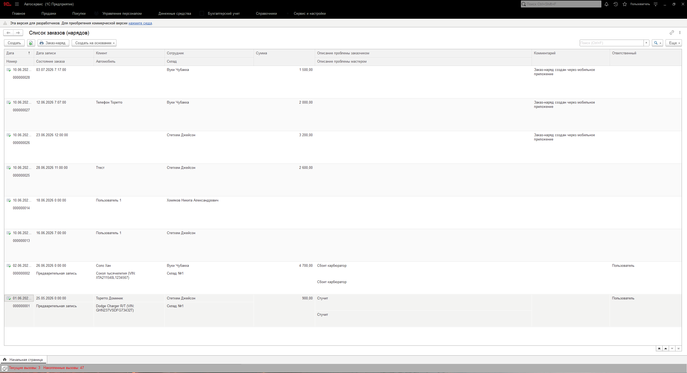
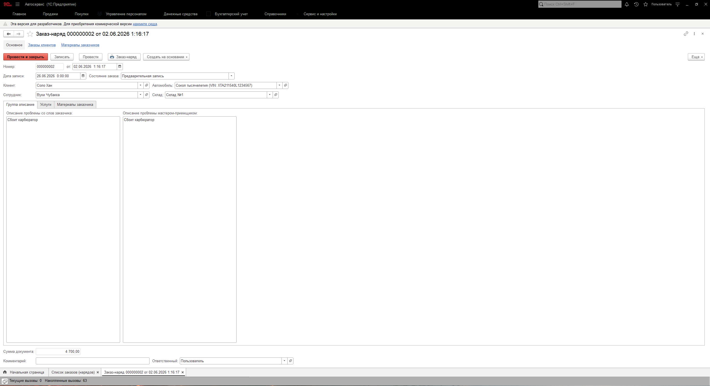
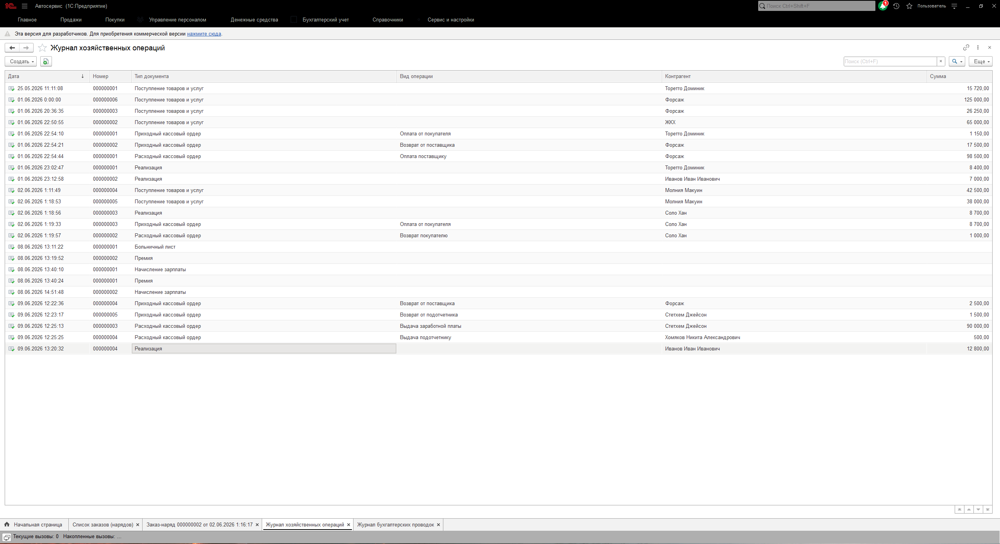
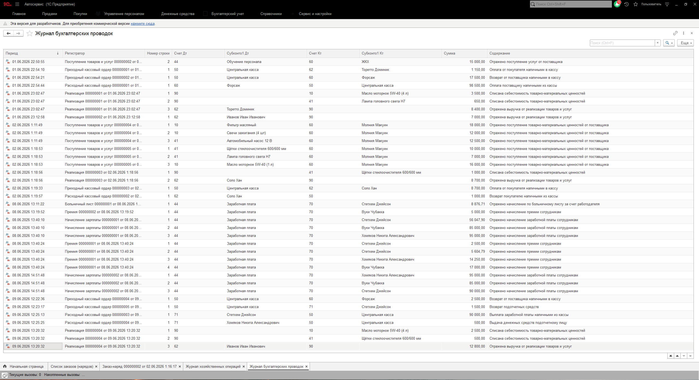

# Автосервис — учебная конфигурация на 1С:Предприятие 8.3

## О проекте

Разработана с нуля в рамках курса 1С-разработчик. Конфигурация предназначена для автоматизации небольшого автосервиса: учет заказов, запчастей, расчетов с клиентами и бухгалтерских проводок.

### Основной функционал

| Компонент | Описание |
|-----------|----------|
| **Справочники** | Услуги, Сотрудники, Должности, Контрагенты, Договоры, Организации, Пользователи, Автомобили, ГрафикиРаботыСотрудников |
| **Документы** | Заказ-наряд, ПоступлениеТоваровИУслуг, Реализация, УчетнаяПолитика, НачислениеЗарплаты, ПриходныйКассоыйОрдер, РасходныйКассоыйОрдер |
| **Регистры накопления** | ТоварыНаСкладах, ДенежныеСредства, Продажи |
| **Регистры сведений** | ЦеныНоменклатуры, УчеитнаяПолитика, ГрафикиРаботыСотрудников, КадроваяИсторияСотрудников |
| **Регистры бухгалтерии** | Проводки по документам (счета 62, 90, 68, 51, 50) |
| **Алгоритм FEFO** | Списание запчастей «сначала истекающие» (First Expired — First Out) с учетом партий и сроков годности |
| **Мобильное приложение** | Клиентская часть для записи на сервис, авторизации и регистрации в основной базе |

### Технологии

- Платформа: 1С:Предприятие 8.3
- Формат выгрузки: XML (совместим с EDT и Git)
- Тип конфигурации: Управляемое приложение

### Как развернуть

1. Создайте пустую информационную базу 1С
2. Откройте Конфигуратор → Конфигурация → Загрузить конфигурацию из файлов...
3. Укажите путь к папке с XML-файлами из этого репозитория
4. Обновите конфигурацию базы данных (F7)
5. Запустите 1С:Предприятие

### Скриншоты

### Мои контакты

- Telegram: [@kisillpavel]
- Email: [pavel.prodakshn@yandex.ru]
- HH.ru: [https://hh.ru/resume/fd6f1864ff10a52de20039ed1f326157785171]
